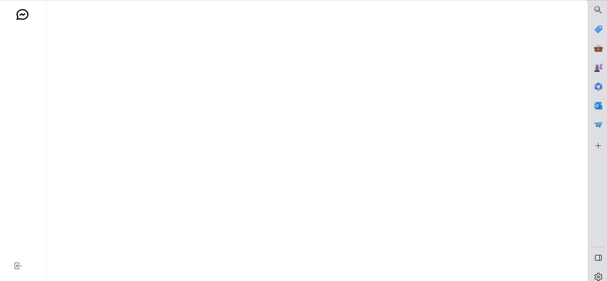
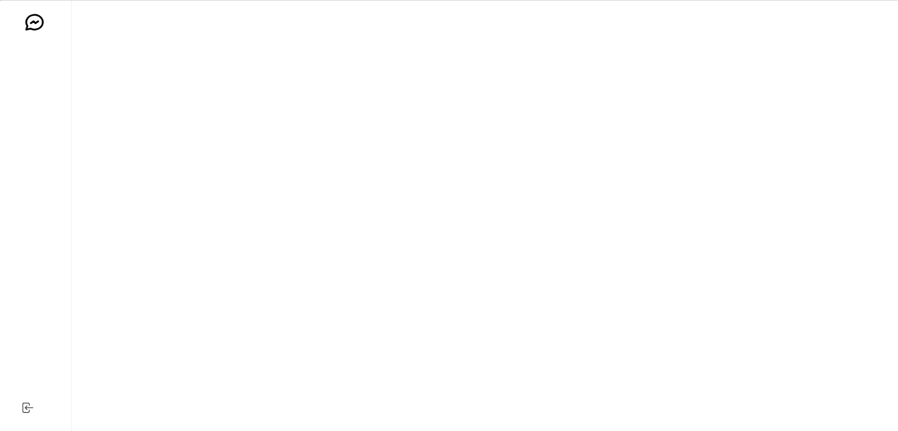
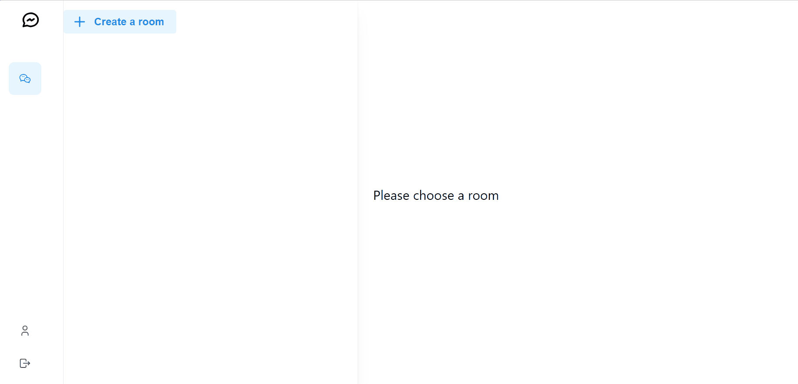
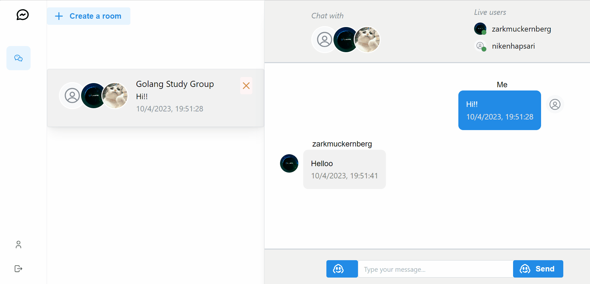

# Real-Time Chat Application with GraphQL, Redis, Prisma, NestJS, and React

This project is a real-time chat application that utilizes GraphQL, Redis, Prisma, NestJS, and React.

## Table of Contents

- [Architecture Overview](#architecture-overview)
- [Prerequisites](#prerequisites)
- [Getting Started](#getting-started)
- [Application Setup](#application-setup)
- [Usage](#usage)
- [Contributing](#contributing)
- [License](#license)

## Architecture Overview

The application is structured with the following components:

- **GraphQL API (NestJS)**: Provides the GraphQL API using NestJS.
- **Prisma**: Serves as an ORM for accessing the database.
- **Redis**: Utilized for real-time updates and subscriptions.
- **React Frontend**: A React-based frontend for the chat application.

## Prerequisites

Ensure you have the following prerequisites installed:

- Node.js
- npm (Node Package Manager)
- Redis Server
- Prisma CLI (`npm install -g prisma`)

## Preview

### **Register Demo**



### **Login Demo**



### **Chatroom Demo**



### **Update Profile Demo**




## Getting Started

1. **Clone the Repository:**

   ```bash
   git clone https://github.com/your-username/realtime-chat-app.git
   cd realtime-chat-app
    ```
2. **Install Dependencies**

    ```bash
    cd backend
    npm install
    cd ../frontend
    npm install
    ```

## Application Setup

### Backend (NestJS, GraphQL, Prisma)

- **Configure Prisma:**
  Copy `.env.example` to `.env` in the backend directory and configure the database connection.

- **Run Prisma Migrations and Generate Prisma Client:**
  ```bash
  cd backend
  npm run prisma:apply
  ```

- **Start the NestJS Server**
    ```bash
    npm start
    ```
The GraphQL API will be accessible at http://localhost:3000/graphql.

### Frontend (React)

- **Configure Backend API Endpoint:**
    Update the GraphQL API endpoint in the frontend/src/config.js file.

- **Start the React Application:**
    ```bash
    cd frontend
    npm start
    ```
The React application will be available at http://localhost:3001.


